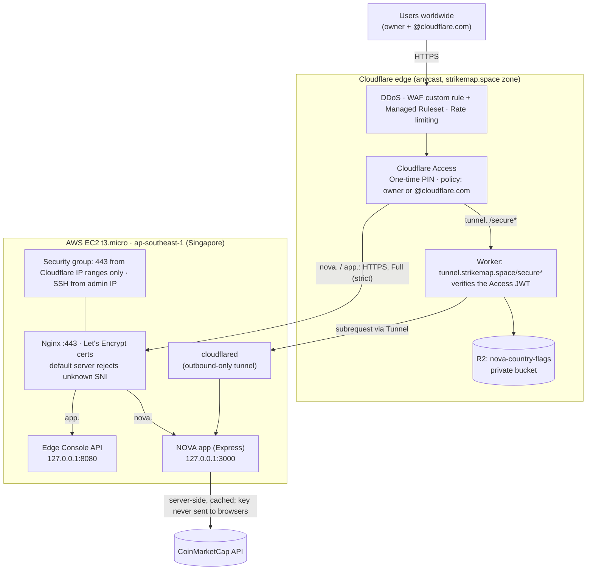

# NOVA × Cloudflare: Solutions Engineer technical project

**NOVA** is a fictional Singapore digital-asset platform. Its application is deliberately simple (a small Node.js
service on **AWS EC2 in ap-southeast-1**), and Cloudflare becomes the security and connectivity control plane around
it: DNS, proxy, Full (strict) TLS, WAF, rate limiting, Access, Tunnel, Workers and R2.

> **Demo environment.** NOVA is a made-up company. Market prices are **real** (CoinMarketCap, fetched by the origin).
> Trading is **simulated**: orders are never executed, and there are no real accounts, balances or trading volume.

---

## Contents

1. [Live endpoints and who can access them](#1-live-endpoints-and-who-can-access-them)
2. [How to get in](#2-how-to-get-in)
3. [Architecture](#3-architecture)
4. [The brief, step by step](#4-the-brief-step-by-step)
5. [Beyond the brief](#5-beyond-the-brief)
6. [Security model](#6-security-model)
7. [Live demo script](#7-live-demo-script)
8. [Real vs simulated data](#8-real-vs-simulated-data)
9. [Repository layout](#9-repository-layout)
10. [Deploying it yourself](#10-deploying-it-yourself)
11. [Operations and troubleshooting](#11-operations-and-troubleshooting)
12. [From demo to production](#12-from-demo-to-production)
13. [Teardown](#13-teardown)
14. [Credits](#14-credits)

---

## 1. Live endpoints and who can access them

| Host | What it is | Path to the origin |
|---|---|---|
| **https://nova.strikemap.space** | NOVA public application (Express): markets with live prices, request inspector, API, status, demo orders | Cloudflare proxy → HTTPS (Full strict) → Nginx → Express |
| **https://tunnel.strikemap.space/secure** | NOVA Staff Portal: the brief's Worker, identity, and flag from private R2 | Access → Worker → Cloudflare Tunnel → Express |
| **https://app.strikemap.space** | NOVA Edge Console: the presentation layer that visualises and drives the live controls | Cloudflare proxy → HTTPS (Full strict) → Nginx → React build + small JSON API |

**All three hosts are protected by Cloudflare Access.** Only two groups get in:

- the project owner (Darshan Hegde), and
- **anyone with an `@cloudflare.com` email address**.

Everyone else is stopped at the Cloudflare Access login page, and nobody can reach the server directly by IP (see
[step 7](#7-access-lock-down-and-7a-no-bypass)).

Useful paths on `nova.strikemap.space`:

| Path | Purpose |
|---|---|
| `/` | Home: live market ticker (CoinMarketCap), platform overview |
| `/markets` | Live market table + **demo order form** (rate limited at the edge) |
| `/headers` | **Brief step 1**: returns every HTTP request header (JSON for `curl`, readable inspector in a browser) |
| `/api` | API reference with copy-paste commands |
| `/status` | Live origin and market-data status |
| `/healthz` | `{"status":"ok","service":"nova-origin","region":"ap-southeast-1"}` |
| `/api/market` | Normalised, cached CoinMarketCap data (the only market endpoint browsers call) |
| `POST /api/orders` | Demo order endpoint; rate limited to 5 requests / 10 s |

---

## 2. How to get in

### In a browser (reviewers)

1. Open any NOVA URL, e.g. **https://tunnel.strikemap.space/secure**.
2. Cloudflare Access shows the login page. Enter your **@cloudflare.com** email address.
3. Access emails you a **one-time PIN**. Paste it in.
4. You land on the page you asked for. The session lasts **24 hours**, and the other NOVA hosts open with a quick
   redirect, normally without a new code.

### From a terminal (API and rate-limit demos)

```bash
brew install cloudflared                                     # macOS; other platforms: Cloudflare docs → cloudflared downloads
cloudflared access login https://nova.strikemap.space        # opens the same Access login in a browser, once
export TOKEN=$(cloudflared access token -app=https://nova.strikemap.space)

curl -H "cf-access-token: $TOKEN" https://nova.strikemap.space/headers
curl -H "cf-access-token: $TOKEN" https://nova.strikemap.space/api/market
```

Without a token, requests get `302` to the Access login page. The WAF and rate limiting still apply to them first
(see [step 4](#4-rate-limiting-and-how-to-demonstrate-it)).

---

## 3. Architecture



Plain-text version:

```
                       USERS (owner + @cloudflare.com)
                                   │ HTTPS
 ┌──────────────────────── CLOUDFLARE EDGE ─────────────────────────┐
 │ DDoS · WAF (custom + managed) · Rate limiting   ← runs first     │
 │ Access (one-time PIN; owner or @cloudflare.com) on all 3 hosts   │
 │ Worker on tunnel.strikemap.space/secure*  ──►  private R2 bucket │
 └───────┬───────────────────────────────────────────┬──────────────┘
         │ nova. / app.: HTTPS, Full (strict)        │ tunnel.: outbound-only Cloudflare Tunnel
         ▼                                           ▼
 ┌──────────── AWS EC2 · ap-southeast-1 ──────────────────────────────┐
 │ Security group: 443 from Cloudflare IPs only · SSH from admin IP   │
 │ Nginx :443 (Let's Encrypt) ─► Express 127.0.0.1:3000 ◄─ cloudflared│
 │                           └─► Console API 127.0.0.1:8080           │
 │ Express ─► CoinMarketCap (server-side cache, key in /etc/nova)     │
 └────────────────────────────────────────────────────────────────────┘
```

---

## 4. The brief, step by step

| # | Requirement | Implementation | Verify |
|---|---|---|---|
| — | Add a domain to Cloudflare and activate it | `strikemap.space` moved to Cloudflare nameservers; zone active (Pro plan; Free would cover the brief) | `dig NS strikemap.space +short` |
| 1 | Origin server with an endpoint returning all request headers | Express app on EC2; `GET /headers` | `curl -H "cf-access-token: $TOKEN" https://nova.strikemap.space/headers` |
| 2 | Proxy traffic through Cloudflare | Orange-clouded DNS records; Always Use HTTPS | `dig nova.strikemap.space +short` returns Cloudflare IPs |
| 3 | Non-Cloudflare cert, Full (strict) | Let's Encrypt (DNS-01) on Nginx; zone SSL mode Full (strict) | Page loads (Cloudflare returns `526` if the origin cert were invalid) |
| 4 | Rate limiting rule + how to demonstrate it | `POST /api/orders`: 5 req / 10 s per IP → block 60 s, JSON 429 | Curl loop: `200 ×5` then `429` |
| 5 | Cloudflare Tunnel on `tunnel.` | Remotely managed `cloudflared` service on EC2 → `localhost:3000` | Zero Trust → Networks → Tunnels: **Healthy**, 4 connections |
| 6 | SSO IdP in Zero Trust | One-time PIN | Login page offers a code by email |
| 7 | Lock down `/secure` to yourself and `@cloudflare.com` | Access app on the whole `tunnel.` host, policy **NOVA Staff** | Anonymous `curl -I https://tunnel.strikemap.space/secure` returns `302` to Access |
| 7a | Nobody can bypass Cloudflare to the origin IP | SG allows 443 only from Cloudflare ranges; apps on loopback; Nginx rejects unknown SNI | `curl -m 5 https://<origin-ip>` times out |
| 8 | Worker on `/secure`: `${EMAIL} authenticated at ${TIMESTAMP} from ${COUNTRY}`, country links to a flag from private R2 | `worker/`: Wrangler, JWT-verified identity, HTML page, `/secure/<CC>` from R2 | Sign in → sentence + link → flag |
| 8a | Built with Wrangler, code in a public Git repo | `worker/wrangler.toml`, `worker/src/index.js` (this repository) | `npx wrangler deploy` |
| 8b | `/secure` returned as HTML | `content-type: text/html; charset=utf-8` | DevTools → Network |
| 8c | `/secure/${COUNTRY}` uses an appropriate content type | `content-type: image/svg+xml` | DevTools → Network |

### 1. Origin web server and the headers endpoint

- **Platform:** AWS EC2 `t3.micro`, Ubuntu 24.04, `ap-southeast-1`, Elastic IP.
- **Server:** Node.js 22 + Express 5 (`app/`), bound to `127.0.0.1:3000`. Nginx terminates TLS in front of it.
- **`GET /headers`** (`app/routes/headers.js`) returns **every request header** the origin received:
  - `curl` / API clients get pretty-printed JSON of all headers.
  - Browsers get the **NOVA Request Inspector**: Ray ID, edge location, visitor country, TLS versions, origin, plus
    the raw header list.
  - Nginx adds `x-origin-tls-protocol` so the Cloudflare → origin TLS version is visible too.

Example (abridged; the address is a documentation example):

```json
{
  "host": "nova.strikemap.space",
  "x-forwarded-proto": "https",
  "x-origin-tls-protocol": "TLSv1.3",
  "cf-ray": "a40ef9ececda5fe5-SIN",
  "cf-connecting-ip": "203.0.113.10",
  "cf-ipcountry": "SG",
  "cf-visitor": "{\"scheme\":\"https\"}",
  "cdn-loop": "cloudflare; loops=1",
  "cf-access-authenticated-user-email": "someone@cloudflare.com",
  "user-agent": "curl/8.7.1",
  "accept": "*/*"
}
```

### 2. Proxy through Cloudflare

| Hostname | Type | Target | Proxy |
|---|---|---|---|
| `nova.strikemap.space` | A | EC2 Elastic IP | Proxied |
| `app.strikemap.space` | A | EC2 Elastic IP | Proxied |
| `tunnel.strikemap.space` | CNAME | `<tunnel-id>.cfargotunnel.com` | Proxied |

Clients only ever see Cloudflare anycast IPs. Zone settings: **Always Use HTTPS** and minimum TLS 1.2; TLS 1.3 is
negotiated on both legs. Details: [`cloudflare/dns.md`](cloudflare/dns.md).

### 3. Full (strict) TLS with a non-Cloudflare certificate

```
Browser ──HTTPS (Cloudflare edge cert)──► Cloudflare ──HTTPS (Let's Encrypt, validated)──► Nginx on EC2
```

- SSL/TLS mode **Full (strict)**: Cloudflare validates the origin certificate's chain, hostname and expiry.
- Origin certificates are **Let's Encrypt**, one per hostname (`nova.`, `app.`), issued with the ACME **DNS-01**
  challenge against Cloudflare DNS (`certbot` + `certbot-dns-cloudflare`, run from the admin machine), so port 80 never
  had to be opened. Private keys live only on the server (root, `0600`).
- Nginx's default server uses `ssl_reject_handshake on`: a TLS client asking for any other name, e.g. the raw IP,
  gets no certificate at all.

Details: [`cloudflare/tls.md`](cloudflare/tls.md).

### 4. Rate limiting and how to demonstrate it

| Rule | Match | Threshold | Action |
|---|---|---|---|
| NOVA orders API | `POST nova.strikemap.space/api/orders` | 5 requests / 10 s, counted per IP + data center | Block 60 s with a custom JSON 429 |
| Console inspector | `app.strikemap.space/headers` | 5 requests / 10 s | Block 60 s with a custom JSON 429 |

**How I would show a customer that it works:**

1. **In the product.** Sign in to <https://nova.strikemap.space/markets> and submit six demo orders within ten seconds.
   Five return an order ID from the origin; the sixth shows **"Too many requests"** with the Cloudflare Ray ID. The UI
   renders the real HTTP 429; nothing in the frontend simulates it.
2. **From a terminal.**

   ```bash
   for i in {1..10}; do
     curl -s -o /dev/null -w "%{http_code}\n" -H "cf-access-token: $TOKEN" \
       -X POST https://nova.strikemap.space/api/orders \
       -H "Content-Type: application/json" -d '{"symbol":"BTC-USDT","side":"buy","quantity":0.01}'
   done
   # 200 200 200 200 200 429 429 429 429 429
   ```

   Anonymous (no token): `302 302 302 302 302 429 429 …`. Rate limiting runs **before** Access, so even
   unauthenticated floods are cut off at the edge.
3. **As evidence.** Security → Events lists each blocked request with the rule, client IP and Ray ID, and the blocked
   requests never appear in the origin log (`journalctl -u nova`).

The 429 body is JSON so API clients can handle it:
`{"error":"rate_limited","message":"Too many requests to POST /api/orders. Blocked at the Cloudflare edge before reaching the NOVA origin."}`

Details: [`cloudflare/rate-limit.md`](cloudflare/rate-limit.md).

### 5. Cloudflare Tunnel on `tunnel.strikemap.space`

- A **remotely managed** tunnel; `cloudflared` runs as a systemd service on the EC2 instance.
- Ingress: `tunnel.strikemap.space` → `http://localhost:3000`.
- `cloudflared` only makes **outbound** connections (four, to Singapore data centers, e.g. SIN11/15/17/20). There is
  no inbound port for this path at all.
- The Edge Console reads connection health from the local metrics endpoint (`127.0.0.1:20241/metrics`).

Details: [`cloudflare/tunnel.md`](cloudflare/tunnel.md).

### 6. SSO identity provider

- **One-time PIN**, which the brief allows as an alternative to a third-party IdP. Access emails a 6-digit code to
  addresses the policy allows.
- Adding Google or Okta later is a settings change: the policies are written against email identity, not the IdP.

### 7. Access lock-down and 7a no bypass

**Access** (details: [`cloudflare/access.md`](cloudflare/access.md)):

| Application | Covers | Policy |
|---|---|---|
| NOVA Staff Portal | `tunnel.strikemap.space` (entire host, so `/secure` and `/secure/<CC>` too) | **NOVA Staff**: owner's email **or** email domain `cloudflare.com` |
| NOVA Public App | `nova.strikemap.space` | **NOVA Staff** |
| NOVA Edge Console | `app.strikemap.space` | **NOVA Staff** |

The brief asks for `/secure`. Protecting the whole staff host is stricter: there is no unprotected path on it to
forget about.

**No bypass**, enforced in four independent layers:

1. **AWS security group:** inbound 443 only from Cloudflare's published IP ranges; SSH only from the admin IP. Every
   other packet is dropped, so a direct request **times out**.
2. **Loopback-only apps:** Express (`:3000`) and the console API (`:8080`) listen on `127.0.0.1`.
3. **Nginx:** the default TLS server rejects any SNI it doesn't know, so there's no certificate for the raw IP.
4. **Tunnel host has no DNS-to-IP path at all:** `tunnel.` is a CNAME to the tunnel, served by an outbound connection.

```bash
curl -m 5 https://<origin-ip>     # → timeout
curl -m 5 http://<origin-ip>      # → timeout
```

### 8. The Worker on `/secure`

`worker/` (Wrangler) is deployed as `siampay-staff-portal` on the route `tunnel.strikemap.space/secure*`.
`workers_dev = false` and `preview_urls = false`, so there is **no `*.workers.dev` URL** that could skip Access.

| Route | Response |
|---|---|
| `GET /secure` | **HTML** page containing `EMAIL authenticated at TIMESTAMP from COUNTRY`, where `COUNTRY` is a link to `/secure/COUNTRY` |
| `GET /secure/<CC>` | The flag, read from the private R2 bucket, `content-type: image/svg+xml` |
| `GET /secure/whoami` | The verified identity as JSON (for the Edge Console, CORS-restricted to `app.strikemap.space`) |

How it works:

- **Identity is verified, not trusted.** The Worker validates the `Cf-Access-Jwt-Assertion` JWT: RS256 signature against
  the team's JWKS (`https://hegdedarsh.cloudflareaccess.com/cdn-cgi/access/certs`, cached 10 min), issuer, audience
  (the Access app's AUD tag) and expiry. A missing or invalid token returns 403.
- `EMAIL` comes from the JWT; `TIMESTAMP` is the JWT's `iat` (the Access authentication time), shown in Singapore time;
  `COUNTRY` is `request.cf.country`.
- **Private R2:** bucket `nova-country-flags` holds 257 flags as `<CC>.svg` (e.g. `SG.svg`). It has no public access
  (r2.dev disabled, no custom domain). The only read path is the Worker's binding `env.FLAGS`. The code is validated
  as `^[A-Z]{2}$`.
- **Through the Tunnel:** the portal also shows live origin and tunnel status by calling
  `/internal/staff-status` on the origin **through the Tunnel**, forwarding the JWT. The origin verifies the JWT
  again (defence in depth) and refuses anything that didn't arrive via the Tunnel.

```bash
cd worker
npx wrangler deploy              # needs CLOUDFLARE_API_TOKEN with Workers + R2 permissions
```

Details: [`cloudflare/r2.md`](cloudflare/r2.md).

---

## 5. Beyond the brief

### Live market data (CoinMarketCap)

- `app/lib/market.js` calls CoinMarketCap `v2/cryptocurrency/quotes/latest` for **BTC, ETH, SOL, BNB, XRP, ADA**
  **from the origin**, caches it, and serves a small normalised document at `GET /api/market`.
- **The API key never reaches a browser.** It lives in `/etc/nova/nova.env` (`root:nova`, `0640`), loaded by systemd as
  `COINMARKETCAP_API_KEY`; the browser only ever calls `/api/market`.
- **Refresh:** at most once per 60 s while someone is viewing, plus a background sample every 15 min for the 24-hour
  sparklines (history kept in `/var/lib/nova/market-history.json`). A daily call budget (450) keeps usage inside the
  plan's credit limit.
- **Honest states:** `LIVE` when fresh, `UPDATING…` during a refresh, and `MARKET DATA DELAYED` (with the last update
  time) if the upstream fails. It keeps the last real values and never generates replacement prices.
- **Demo trading stays demo.** `POST /api/orders` responds with `"executed": false` and the live reference price for
  context. The UI states **"Demo environment · no real trades executed"** wherever orders appear.

### NOVA Edge Console (`app.strikemap.space`)

React 19 + Vite 6 + TypeScript + Tailwind v4, with a small zero-dependency Node API (`origin/server.js`). It's the SE's
presentation layer: it turns the live controls into something a non-technical stakeholder can follow.

| Page | What it does |
|---|---|
| Overview | Globe, KPI row (live origin/tunnel health), live traffic, request journey, security and resiliency posture |
| Inspector | Live request trace: colo, TLS version, key exchange (incl. post-quantum `X25519MLKEM768`), Ray ID |
| Security | Fires real requests that the WAF custom rule blocks (JSON 403) |
| Rate limiting | Fires a real burst and shows the edge's 429s |
| TLS | Edge certificate vs origin certificate, Full (strict) explained |
| Staff | Access identity via the Worker's `/secure/whoami` |
| Logs | Recent origin requests (what actually reached AWS) |
| Economics | Illustrative edge-handled vs origin-bound traffic model; compares AWS-native with Cloudflare + AWS without naming a winner |

Anything simulated (KPI totals, traffic mix, globe latencies, failover drill, economics) is labelled **Simulated / Demo**.

### Also configured

- **WAF custom rule:** blocks common probes (`<script`, `union select`, `/.env`, `/.git`, `wp-login`) on all three hosts
  with a JSON 403. Like rate limiting, it runs before Access.
- **Cloudflare Managed Ruleset** enabled on the zone (Pro plan).

---

## 6. Security model

| Layer | Control |
|---|---|
| Edge | DDoS protection, WAF custom rule + Managed Ruleset, rate limiting. These run **before** Access |
| Identity | Access on every host; one reusable policy (owner + `@cloudflare.com`); one-time PIN; 24 h sessions |
| Application | Worker and origin both verify the Access JWT; strict CSP and security headers on NOVA pages |
| Transport | TLS 1.2+ at the edge, Full (strict) to the origin, TLS 1.3 observed on both legs |
| Network | Security group limited to Cloudflare ranges; apps on loopback; Tunnel is outbound-only; no `workers.dev` route |
| Data | R2 bucket private (binding-only); CoinMarketCap key server-side only |
| Secrets | Never committed: `.secrets/`, `*.pem` and env files are git-ignored; keys are installed over SSH stdin |

---

## 7. Live demo script

About 5 minutes. Sign in once beforehand (the session lasts 24 h), so a slow PIN email can't stall the demo.

| # | Show | Where | What to point out |
|---|---|---|---|
| 1 | Access | Open any NOVA host in a private window | Login page; only owner / `@cloudflare.com` get a code |
| 2 | Request context | `nova.strikemap.space/headers` | Ray ID, country, TLS 1.3, `cf-connecting-ip`, the origin sees Cloudflare |
| 3 | Full (strict) TLS | Padlock (edge cert) + Inspector | Two TLS legs; the origin cert is Let's Encrypt, validated |
| 4 | Rate limiting | `/markets` (six orders) or the curl loop | `200 ×5` then `429` with a Ray ID; blocked requests never reach AWS |
| 5 | WAF | `curl "https://nova.strikemap.space/?q=<script>"` | `403` JSON, even without logging in |
| 6 | Tunnel + Worker | `tunnel.strikemap.space/secure` | The required sentence, JWT-verified identity, live tunnel status |
| 7 | Private R2 | Click the country link | `image/svg+xml` from a bucket with no public URL |
| 8 | No bypass | `curl -m 5 https://<origin-ip>` | Timeout |

---

## 8. Real vs simulated data

| Real | Simulated / illustrative (labelled in the UI) |
|---|---|
| AWS EC2 in ap-southeast-1 | NOVA as a company, its customers and trading volume |
| Cloudflare Ray IDs, edge location, visitor country | Order execution (orders are never executed) |
| TLS versions on both legs | Edge Console KPI totals and traffic mix |
| Rate-limit 429s and WAF 403s | Globe latencies and the failover drill |
| Access authentication and JWT claims | Edge Economics traffic percentages |
| Tunnel connections and health | |
| R2 object retrieval | |
| Market prices, 24 h change, volume (CoinMarketCap) | |

---

## 9. Repository layout

```
app/                    NOVA public application (Express, server-rendered)
  server.js             security headers + CSP, routes, error pages; listens on 127.0.0.1:3000
  routes/               pages (/, /markets, /api, /status), headers, market, orders, health, staff
  lib/                  market.js (CoinMarketCap cache), edge.js (Access JWT, tunnel status), layout.js, coins.js
  public/               app.js (live data, order form), globe.js, styles.css, globe-dots.json
  nova.service          systemd unit (EnvironmentFile /etc/nova/nova.env, StateDirectory nova)
worker/                 /secure* Worker (Wrangler): wrangler.toml, src/index.js
r2/flags/               country flags (flag-icons, MIT), uploaded to the private bucket
cloudflare/             runbooks: dns · tls · rate-limit · tunnel · access · r2
web/                    NOVA Edge Console (React + Vite + TS + Tailwind)
origin/                 Edge Console API (Node), Nginx config, systemd unit, EC2 bootstrap
scripts/                deploy-origin.sh (build + ship everything), upload-flags.sh
```

> Some internal names (`siampay` service/config, the Worker name `siampay-staff-portal`) come from an earlier
> iteration of the story. They're internal only and not visible to users.

---

## 10. Deploying it yourself

**Prerequisites:** a Cloudflare zone, an EC2 instance (Ubuntu 24.04) with an Elastic IP and the security group
described above, Node 22, `wrangler`, and a Cloudflare API token with DNS, Zone Settings, WAF, Access, Tunnel,
Workers and R2 permissions.

```bash
# 1. Origin certificates (Let's Encrypt via DNS-01), run locally.
#    cloudflare.ini contains: dns_cloudflare_api_token = <token with Zone:DNS:Edit>
uvx --python 3.12 --with certbot-dns-cloudflare --with 'cryptography<46' certbot certonly \
  --dns-cloudflare --dns-cloudflare-credentials cloudflare.ini \
  -d nova.strikemap.space \
  --config-dir .secrets/le/config --work-dir .secrets/le/work --logs-dir .secrets/le/logs

# 2. Build and ship the NOVA app, the Edge Console, Nginx config and certs
cd web && npm install && cd ..
ORIGIN_IP=<elastic-ip> ./scripts/deploy-origin.sh
#    COINMARKETCAP_API_KEY is read from the environment or ~/.cf-demo.env and written to /etc/nova/nova.env

# 3. Worker and private R2 bucket
cd worker && npx wrangler deploy && cd ..
CLOUDFLARE_API_TOKEN=… CLOUDFLARE_ACCOUNT_ID=… ./scripts/upload-flags.sh
```

Then in the dashboard (or API): proxied DNS records, SSL/TLS **Full (strict)**, the rate-limiting and WAF rules, a
remotely managed tunnel (`tunnel.` → `http://localhost:3000`), the one-time PIN IdP, and the three Access applications
with the shared policy. The runbooks in [`cloudflare/`](cloudflare/) list every setting.

**Secrets are never committed:** API tokens, the tunnel token, TLS private keys, SSH keys and the CoinMarketCap key.

---

## 11. Operations and troubleshooting

| Symptom | Likely cause | Check |
|---|---|---|
| Access login loops or "not allowed" | Email not the owner's and not `@cloudflare.com` | Zero Trust → Logs → Access |
| `526 Invalid SSL certificate` | Origin cert expired or wrong name | `sudo openssl x509 -enddate -noout -in /etc/ssl/nova/fullchain.pem` (current certs expire 24–25 Dec 2026) |
| `1033` on `tunnel.` | `cloudflared` not connected | `systemctl status cloudflared`; Zero Trust → Networks → Tunnels |
| Orders keep returning 429 | You're inside the 60 s block window | Wait 60 s |
| "Market data delayed" | CoinMarketCap unreachable or budget reached | `journalctl -u nova \| grep market`; `curl -s localhost:3000/api/market` on the host |
| Page looks stale after a deploy | Browser cache | Hard refresh; asset URLs are versioned on each restart |

Logs: `journalctl -u nova` (NOVA app), `journalctl -u siampay` (console API), `journalctl -u cloudflared`,
Cloudflare Security → Events, Zero Trust → Logs → Access.

---

## 12. From demo to production

What I'd recommend for a real NOVA deployment (none of these is claimed as enabled in the demo):

- **Resilience:** a second `cloudflared` connector in another AZ; AWS-side redundancy (ALB + multi-AZ) and health
  checks; a documented break-glass path; consider multi-provider DNS where appropriate.
- **Security depth:** Bot Management, Advanced Rate Limiting (per-API-key / session counting), API Shield schema
  validation, Authenticated Origin Pulls or a Tunnel-only origin.
- **Observability and data:** Logpush to the SIEM, Data Localization Suite if regulators require regional processing.
- **Commercials:** Enterprise SLA and support, scoped against NOVA's actual traffic, applications and log volume. The
  economics model in the console is illustrative, not a quote.

---

## 13. Teardown

EC2 instance and Elastic IP · security group · Cloudflare Tunnel · Access applications and policy · Worker ·
R2 buckets (`nova-country-flags`, legacy `cf-se-demo-flags`) · DNS records · WAF / rate-limit rules · revoke the
Cloudflare API token and the CoinMarketCap key.

---

## 14. Credits

- Country flags: [flag-icons](https://github.com/lipis/flag-icons) (MIT).
- Globe land data: [Natural Earth](https://www.naturalearthdata.com/) (public domain) via `world-atlas`.
- Market data powered by [CoinMarketCap](https://coinmarketcap.com/api/). NOVA is not affiliated with CoinMarketCap.
- NOVA is a fictional company created for a Cloudflare Solutions Engineering technical project.
