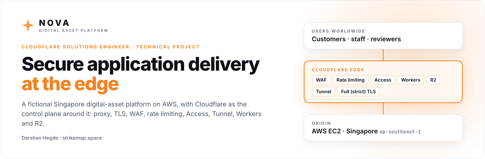
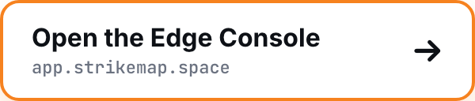
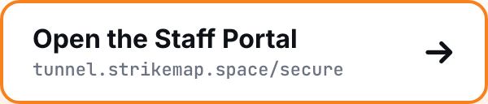
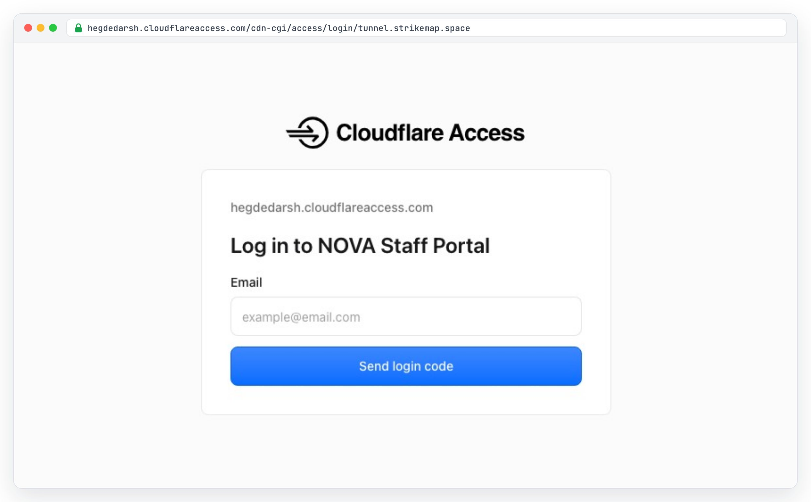
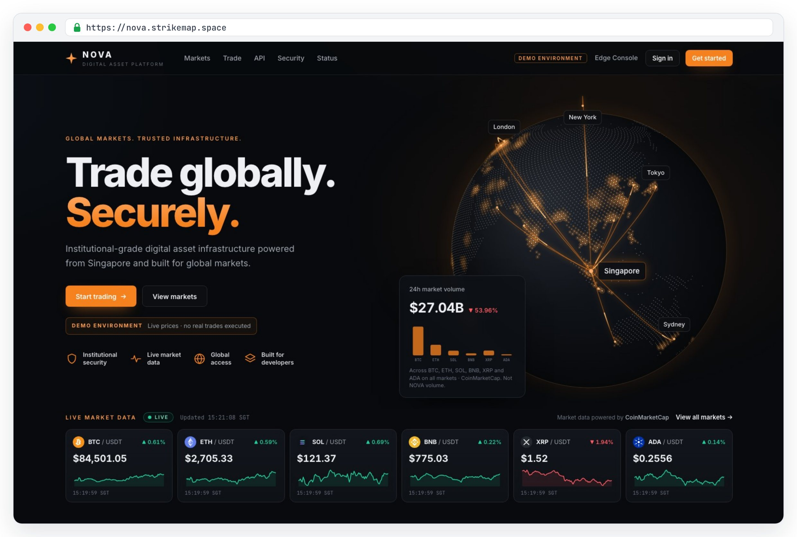
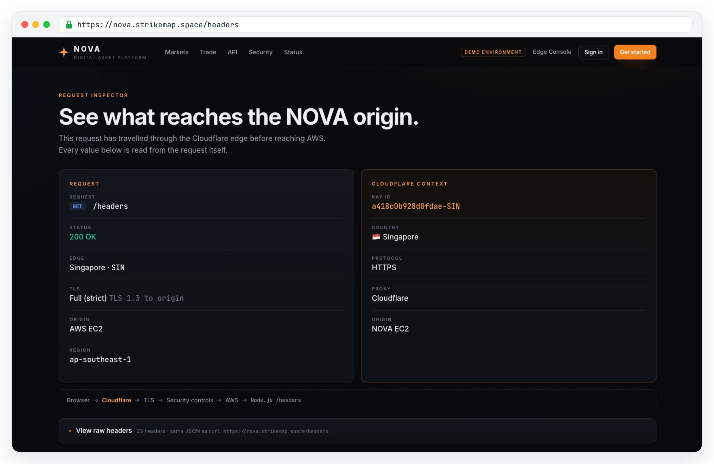
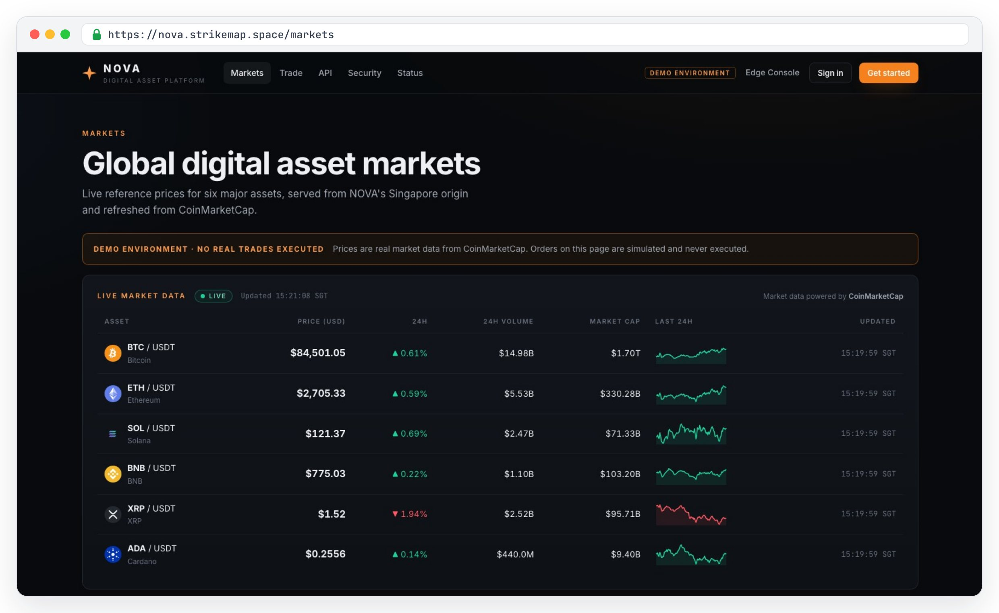
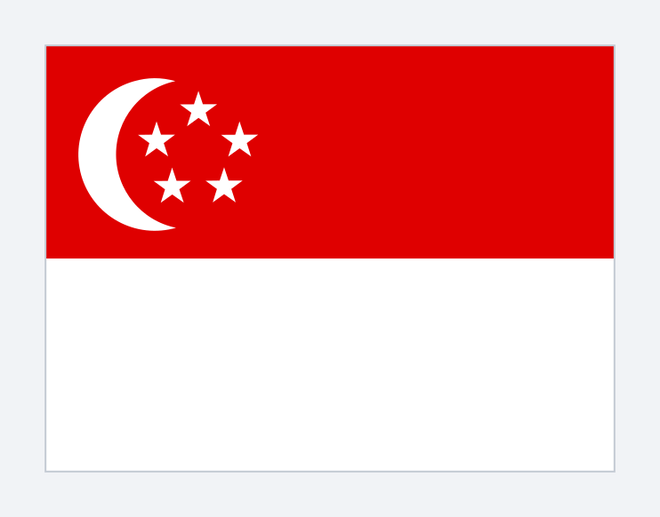
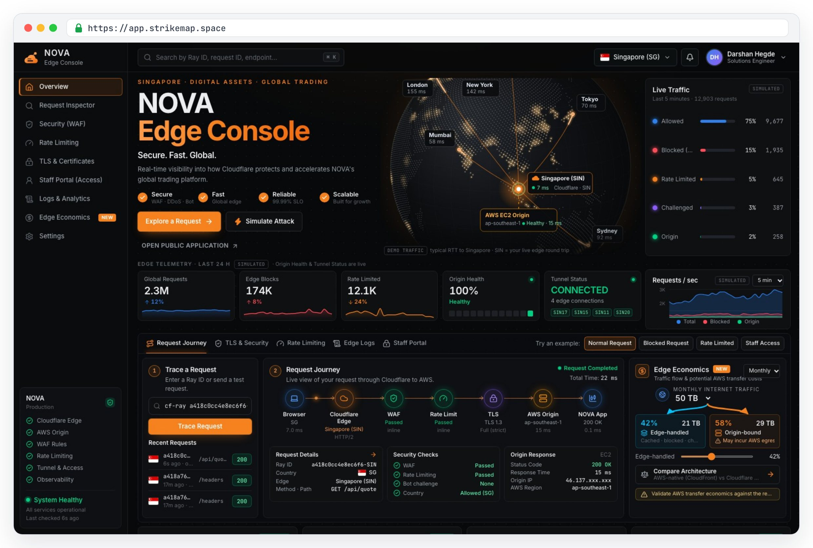
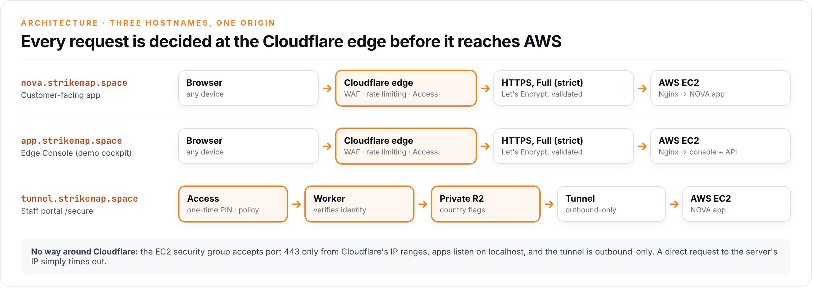

<p align="center">
  
</p>

<p align="center">
  <a href="https://nova.strikemap.space"></a>
  <a href="https://app.strikemap.space"></a>
  <a href="https://tunnel.strikemap.space/secure"></a>
  <a href="docs/NOVA_Access_Guide.pdf"></a>
</p>

> [!IMPORTANT]
> **Sign-in required.** All three sites are protected by Cloudflare Access. Use your **@cloudflare.com** email address:
> a one-time code arrives by email, and you stay signed in for 24 hours. [How to sign in ↓](#start-here-sign-in)

**NOVA** is a fictional Singapore digital-asset platform. Its application is deliberately simple and runs on
**AWS EC2 in Singapore**. Cloudflare sits in front of it as the control plane: it secures, filters, authenticates and
connects every request before anything reaches AWS.

The walkthrough below takes about **10 minutes**. Each step shows one Cloudflare use case: click the link, then compare
what you see with the screenshot.

| Site | What it is |
|---|---|
| **[nova.strikemap.space](https://nova.strikemap.space)** | The customer-facing NOVA app: live market prices, request inspector, demo trading |
| **[tunnel.strikemap.space/secure](https://tunnel.strikemap.space/secure)** | The private staff portal: Access → Worker → Tunnel, with a file from private R2 |
| **[app.strikemap.space](https://app.strikemap.space)** | The Edge Console: a visual cockpit that runs and explains the live controls |

---

## Start here: sign in

1. Click any of the buttons above. You'll see the **Cloudflare Access** login page.
2. Enter your **@cloudflare.com** email address and click **Send login code**.
3. Paste the **one-time PIN** from your inbox.
4. You're in. The other NOVA sites open with a quick redirect, normally without a new code.



<sub>Only the project owner and @cloudflare.com addresses receive a code. Everyone else stops here.</sub>

---

## The walkthrough

| Step | Use case | Cloudflare products | Open |
|:--:|---|---|---|
| 1 | [Put a secure edge in front of an AWS app](#step-1-open-the-nova-app) | DNS · Proxy · Full (strict) TLS | [nova.strikemap.space](https://nova.strikemap.space) |
| 2 | [See exactly what reaches the server](#step-2-see-what-reaches-the-server) | Proxy · request headers | [/headers](https://nova.strikemap.space/headers) |
| 3 | [Stop API abuse before it reaches AWS](#step-3-trigger-the-rate-limit) | Rate limiting | [/markets](https://nova.strikemap.space/markets) |
| 4 | [Block attacks at the edge](#step-4-watch-the-waf-block-an-attack) | WAF | [Try an attack](https://nova.strikemap.space/?q=%3Cscript%3Ealert(1)%3C/script%3E) |
| 5 | [Give staff access without a VPN](#step-5-open-the-private-staff-portal) | Access · Workers · Tunnel | [/secure](https://tunnel.strikemap.space/secure) |
| 6 | [Serve private files with no public URL](#step-6-load-a-file-from-private-r2) | Workers · R2 | [/secure/SG](https://tunnel.strikemap.space/secure/SG) |
| 7 | [Make sure nobody can skip Cloudflare](#step-7-try-to-go-around-cloudflare) | Proxy · Tunnel · origin lock-down | Terminal |
| 8 | [Explain it all to a stakeholder](#step-8-explore-the-edge-console) | All of the above, visualised | [app.strikemap.space](https://app.strikemap.space) |

---

### Step 1: Open the NOVA app

**Use case:** a company runs its application on AWS and wants a secure, fast front door for global customers.<br>
**Cloudflare:** DNS · Proxy · Full (strict) TLS with the company's own (non-Cloudflare) certificate<br>
**Open:** **[nova.strikemap.space](https://nova.strikemap.space)**

**You should see:** the NOVA home page with **live crypto prices** (from CoinMarketCap) and a clear
*Demo environment* label. Every request travelled browser → Cloudflare → encrypted and validated → AWS Singapore.



<sub>NOVA is fictional: prices are real market data, but orders are simulated and never executed.</sub>

---

### Step 2: See what reaches the server

**Use case:** visibility. Prove that traffic really flows through Cloudflare, and see what Cloudflare adds.<br>
**Cloudflare:** Proxy (request headers such as `CF-Ray`, `CF-IPCountry`, `CF-Connecting-IP`)<br>
**Open:** **[nova.strikemap.space/headers](https://nova.strikemap.space/headers)**

**You should see:** your Cloudflare **Ray ID**, the edge location that served you, your country, **TLS 1.3** on both
legs and *Full (strict)*. Expand **View raw headers** for the complete list the server received. From a terminal, the
same URL returns every header as JSON.



---

### Step 3: Trigger the rate limit

**Use case:** protect a sensitive API (placing orders) from bots and abuse, before it costs anything on AWS.<br>
**Cloudflare:** Rate limiting: 5 requests per 10 seconds per client, then blocked for 60 seconds<br>
**Open:** **[nova.strikemap.space/markets](https://nova.strikemap.space/markets)**, scroll to **Demo order** and press **Submit demo order** six times quickly

**You should see:** the first five return *"Demo order accepted · not executed"* with an order ID. The sixth shows
**"Too many requests"** with a Cloudflare Ray ID. That response came from the edge; the server never saw it.



<details>
<summary><b>Terminal version</b> (optional)</summary>

```bash
for i in {1..10}; do
  curl -s -o /dev/null -w "%{http_code} " -X POST https://nova.strikemap.space/api/orders \
    -H "Content-Type: application/json" -d '{"symbol":"BTC-USDT","side":"buy","quantity":0.01}'
done
# 302 302 302 302 302 429 429 429 429 429
```

Anonymous requests get `302` (redirect to the sign-in page), yet request six is still blocked with **`429`**: the rate
limit runs *before* Access. Signed in (with an Access token, see [docs](docs/TECHNICAL.md#from-a-terminal-api-and-rate-limit-demos)),
the output is `200 ×5` then `429`.

```json
{"error":"rate_limited","message":"Too many requests to POST /api/orders. Blocked at the Cloudflare edge before reaching the NOVA origin."}
```
</details>

---

### Step 4: Watch the WAF block an attack

**Use case:** stop common attacks (cross-site scripting, SQL injection, secret scanning) at the edge.<br>
**Cloudflare:** WAF custom rule + Cloudflare Managed Ruleset<br>
**Open:** **[this link, which contains a `<script>` attack](https://nova.strikemap.space/?q=%3Cscript%3Ealert(1)%3C/script%3E)**, no sign-in needed

**You should see:** a `403` blocked message. Like rate limiting, the WAF runs before the sign-in page.

```json
{"error":"blocked_by_waf","message":"Request blocked by Cloudflare WAF before reaching the NOVA origin."}
```

---

### Step 5: Open the private staff portal

**Use case:** employees need an internal tool. There's no VPN, and the server is never exposed to the internet.<br>
**Cloudflare:** **Access** checks who you are → a **Worker** builds the page at the edge → **Tunnel** carries the
request to AWS over an outbound-only connection<br>
**Open:** **[tunnel.strikemap.space/secure](https://tunnel.strikemap.space/secure)**

**You should see** the line the brief asks for, with your own details:

> `you@cloudflare.com authenticated at 2026-09-27 15:30:12 SGT from SG`

Below it is live status for the Tunnel and the AWS server, fetched *through* the Tunnel. The Worker verifies your
Access identity token itself rather than trusting a header, and the server checks it again.

---

### Step 6: Load a file from private R2

**Use case:** serve private files (documents, images, reports) that have no public link at all.<br>
**Cloudflare:** Workers + R2 object storage (private bucket, no public URL)<br>
**Open:** click the **country code** on the staff portal, e.g. **[tunnel.strikemap.space/secure/SG](https://tunnel.strikemap.space/secure/SG)**

**You should see** your country's flag, read by the Worker from the private bucket and served as `image/svg+xml`. The
Worker frames it on the way out, so white areas (like the lower half of Singapore's flag) stay visible on a white page.
Add `?raw=1` to get the file exactly as stored in R2.



---

### Step 7: Try to go around Cloudflare

**Use case:** make sure attackers can't skip every control above by going straight to the server's IP address.<br>
**Cloudflare + AWS:** the server accepts web traffic **only** from Cloudflare's IP ranges; the apps listen on
localhost; the Tunnel is outbound-only.

```bash
curl -m 5 -k https://<server-ip>
# (no response) timed out after 5 seconds
```

The server's IP is available on request for the panel demo.

---

### Step 8: Explore the Edge Console

**Use case:** explain all of this to a non-technical stakeholder, live, in one screen.<br>
**Open:** **[app.strikemap.space](https://app.strikemap.space)**

**You should see:** a live request journey (browser → Cloudflare → WAF → rate limit → TLS → AWS), one-click WAF and
rate-limit demos, TLS details, Tunnel health and an edge-economics model. Values that are illustrative are labelled
*Simulated*.



---

## How it fits together



## Assignment checklist

| # | Requirement | Where to see it |
|:--:|---|---|
| — | Domain on Cloudflare, nameservers changed | `strikemap.space` is served by Cloudflare |
| 1 | Origin server with an endpoint returning all request headers | [Step 2](#step-2-see-what-reaches-the-server): [/headers](https://nova.strikemap.space/headers) |
| 2 | Traffic proxied through Cloudflare | [Step 1](#step-1-open-the-nova-app) |
| 3 | Full (strict) TLS with a non-Cloudflare certificate | [Step 2](#step-2-see-what-reaches-the-server) (Let's Encrypt on the server) |
| 4 | Rate limiting rule, and how to demonstrate it | [Step 3](#step-3-trigger-the-rate-limit) |
| 5 | Cloudflare Tunnel on `tunnel.` | [Step 5](#step-5-open-the-private-staff-portal) |
| 6 | SSO identity provider in Zero Trust | [Sign in](#start-here-sign-in) (one-time PIN) |
| 7 | `/secure` locked to the owner and `@cloudflare.com` | [Sign in](#start-here-sign-in) · [Step 5](#step-5-open-the-private-staff-portal) |
| 7a | Nobody can bypass Cloudflare to the server IP | [Step 7](#step-7-try-to-go-around-cloudflare) |
| 8 | Worker: `EMAIL authenticated at TIMESTAMP from COUNTRY`, country flag from private R2 | [Step 5](#step-5-open-the-private-staff-portal) · [Step 6](#step-6-load-a-file-from-private-r2) |
| 8a | Built with Wrangler, code in a public repo | [`worker/`](worker/) in this repository |
| 8b | `/secure` returned as HTML | `content-type: text/html` |
| 8c | `/secure/COUNTRY` with an appropriate content type | `content-type: image/svg+xml` |

## For engineers

- **[Technical documentation](docs/TECHNICAL.md):** every requirement with verification commands, architecture,
  security model, deployment, troubleshooting, production recommendations.
- **[Access guide (PDF, 2 pages)](docs/NOVA_Access_Guide.pdf):** the sign-in steps and checks, printable.
- **Runbooks:** [DNS](cloudflare/dns.md) · [TLS](cloudflare/tls.md) · [Rate limiting](cloudflare/rate-limit.md) ·
  [Tunnel](cloudflare/tunnel.md) · [Access](cloudflare/access.md) · [R2](cloudflare/r2.md)
- **Code:** [`worker/`](worker/) (the `/secure` Worker) · [`app/`](app/) (NOVA app) · [`web/`](web/) (Edge Console) ·
  [`origin/`](origin/) (server config) · [`scripts/`](scripts/) (deploy)

<sub>NOVA is a fictional company created for a Cloudflare Solutions Engineering technical project. Market data powered
by CoinMarketCap (not affiliated). Flags: flag-icons (MIT). Globe data: Natural Earth (public domain).</sub>
